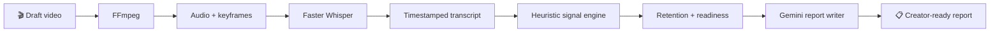

<div align="center">

# ◉ Pre<span style="color:#ff0000">Flight</span>

### The pre-publish copilot for creators who want to earn the next second.

[](https://preflight-mvp-scaffold.vercel.app/)
[](https://preflight-mvp-scaffold.vercel.app/report/demo)
[](https://preflight-backend-ftv2.onrender.com/health)

**Upload a draft. Find the moment attention slips. Publish a stronger cut.**

</div>

---

## ✦ What PreFlight does

PreFlight gives creators an explainable pre-publish review of a YouTube draft. It turns a video into an estimated retention curve, highlights the single riskiest segment, and pairs that finding with a concrete edit plus a sharper hook rewrite.

> [!IMPORTANT]
> Every score is an **explainable heuristic estimate**—not a trained prediction based on real viewer-behavior data. Gemini writes the report language; it does not create the numeric scores.

## 🎛️ The experience

| Upload with confidence | Watch the analysis work | Leave with a plan |
| :--- | :--- | :--- |
| **Drag-and-drop video upload** with API-health feedback, file-size guidance, and a sample report. | **Live stage timeline** that reflects backend progress, shows elapsed time, an ETA, and explains each processing step. | **Creator Checklist** with the top edit, hook rewrite, one-click copy, and `.txt` download. |

| 📈 **Readiness dashboard** | 🎯 **Top-risk callout** | 🪝 **Hook autopsy** |
| :--- | :--- | :--- |
| Gauge, retention chart, and a compact score breakdown make the estimated outcome legible at a glance. | The steepest estimated retention drop is visually highlighted with an actionable fix. | The first 15 seconds receive an evidence-based assessment and a suggested opening line. |

## ⚡ From upload to edit



### The signal engine

The timeline is split into 5-second segments. Each segment is scored using:

- **Visual pacing** — scene-change frequency from sampled keyframes.
- **Audio energy** — relative loudness against the video’s own baseline.
- **Dead air** — proportion of low-RMS audio windows.
- **Delivery** — speaking pace and a lightweight filler-word heuristic.
- **Opening strength** — hook patterns, first-15-second pace, and energy.

Those signals produce a deliberately monotonic estimated retention curve: strong moments can flatten the decline, but never fabricate audience recovery.

## 🧩 Product components

```text
╭──────────────────────── Frontend · Next.js ────────────────────────╮
│  Brand shell · Upload surface · Processing timeline · Report view  │
│  Retention chart · Readiness gauge · Checklist export              │
╰────────────────────────────────────────────────────────────────────╯
                              │ REST + polling
╭──────────────────────── Backend · FastAPI ─────────────────────────╮
│  Upload jobs · FFmpeg · Whisper · Signal heuristics · Gemini copy  │
│  SQLite job state · Demo fixture                                   │
╰────────────────────────────────────────────────────────────────────╯
```

| Layer | Built with |
| --- | --- |
| UI | Next.js 16 · React 19 · TypeScript · Tailwind CSS 4 · Recharts |
| API | FastAPI · Pydantic · SQLAlchemy · SQLite |
| Video intelligence | FFmpeg · Faster Whisper |
| Report language | Google Gemini structured output |
| Hosting | Vercel frontend · Render Docker backend |

## 🚀 Run it locally

### 1. Start the API

```bash
cd backend
python3 -m venv .venv
source .venv/bin/activate
pip install -r requirements.txt
cp .env.example .env
uvicorn app.main:app --reload --port 8001
```

Set `GEMINI_API_KEY` in `backend/.env` for live report writing. For a no-network demo, set `DEMO_MODE=true`; uploads then resolve to the committed demo report without running FFmpeg, Whisper, or Gemini.

### 2. Start the UI

```bash
cd frontend
npm install
cp .env.local.example .env.local
npm run dev
```

Use `NEXT_PUBLIC_API_BASE_URL=http://localhost:8001` in `frontend/.env.local` for the local API.

## 🔌 API at a glance

| Method | Endpoint | What it gives you |
| :---: | --- | --- |
| `GET` | `/health` | Service availability |
| `POST` | `/analyze` | A job ID for an uploaded video |
| `GET` | `/status/{job_id}` | Current pipeline stage or safe error |
| `GET` | `/report/{job_id}` | Completed retention analysis and recommendations |
| `GET` | `/report/demo` | Built-in report fixture for demos |

## 🌐 Deployment

| Service | Live link |
| --- | --- |
| Web app | [preflight-mvp-scaffold.vercel.app](https://preflight-mvp-scaffold.vercel.app/) |
| Demo report | [Open demo](https://preflight-mvp-scaffold.vercel.app/report/demo) |
| FastAPI backend | [preflight-backend-ftv2.onrender.com](https://preflight-backend-ftv2.onrender.com/health) |

The Render image ships with FFmpeg and pre-downloads the Faster Whisper `base` model. Set `CORS_ORIGINS` to the Vercel URL (and local frontend URL if needed) as either a comma-separated list or JSON array.

---

<div align="center">

Built for creators who would rather find the weak moment **before** their audience does.

</div>
